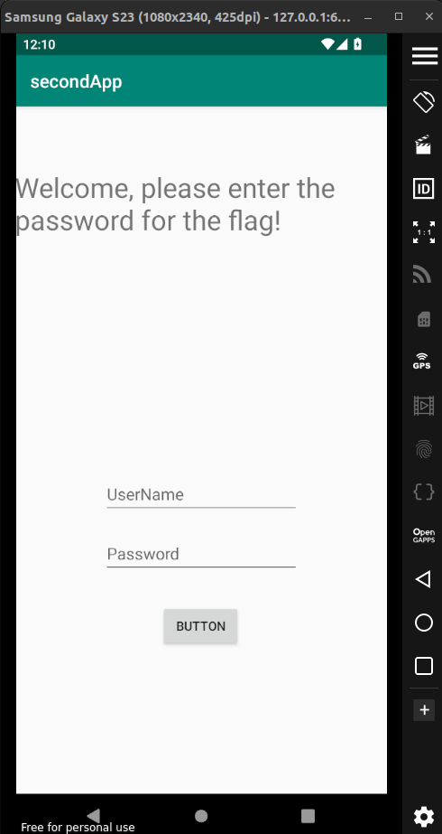
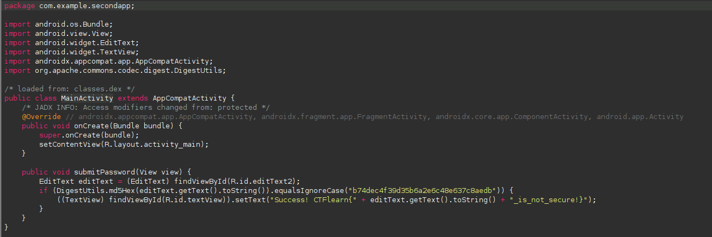
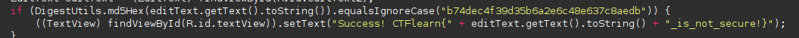
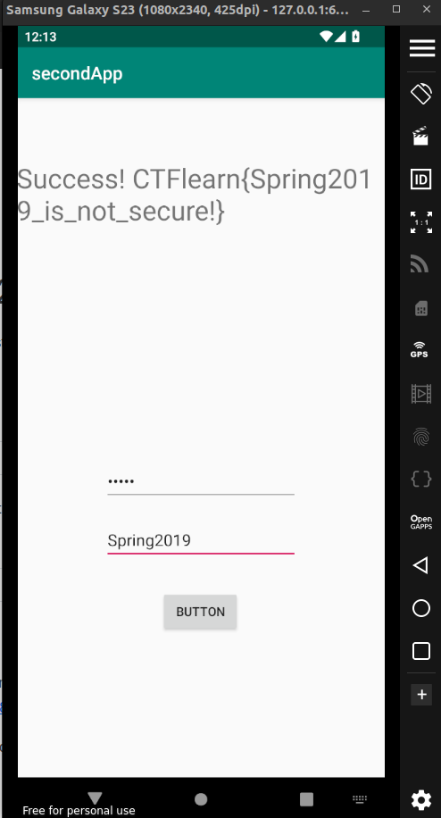

##  Harcoded decryptable md5 hash

This is a simple Android application where users are required to enter a password. If the password matches a specific MD5 hash, the app will display a success message along with the flag.

### 1. Android Application Code

The Android app consists of a basic UI with two EditText fields for username and password. Below is a breakdown of the relevant parts:

**Code Overview**

**Key Points**

The app uses DigestUtils.md5Hex() to hash the password entered by the user.

The app checks if the hashed password matches the hardcoded hash: b74dec4f39d35b6a2e6c48e637c8aedb.

Upon success, the app displays a flag in the format CTFlearn{Spring2019_is_not_secure!}.

**FLAG - CTFlearn{Spring2019_is_not_secure!}**

