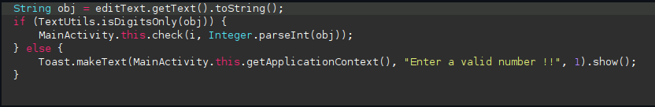
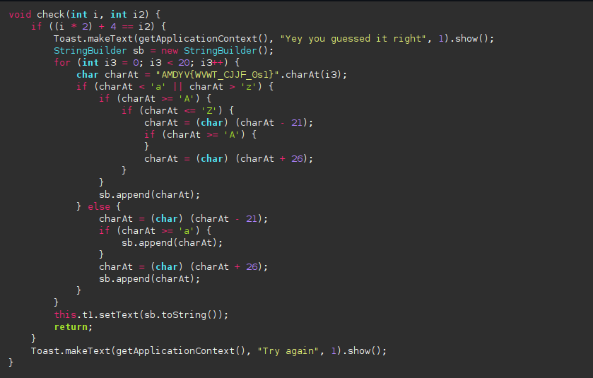
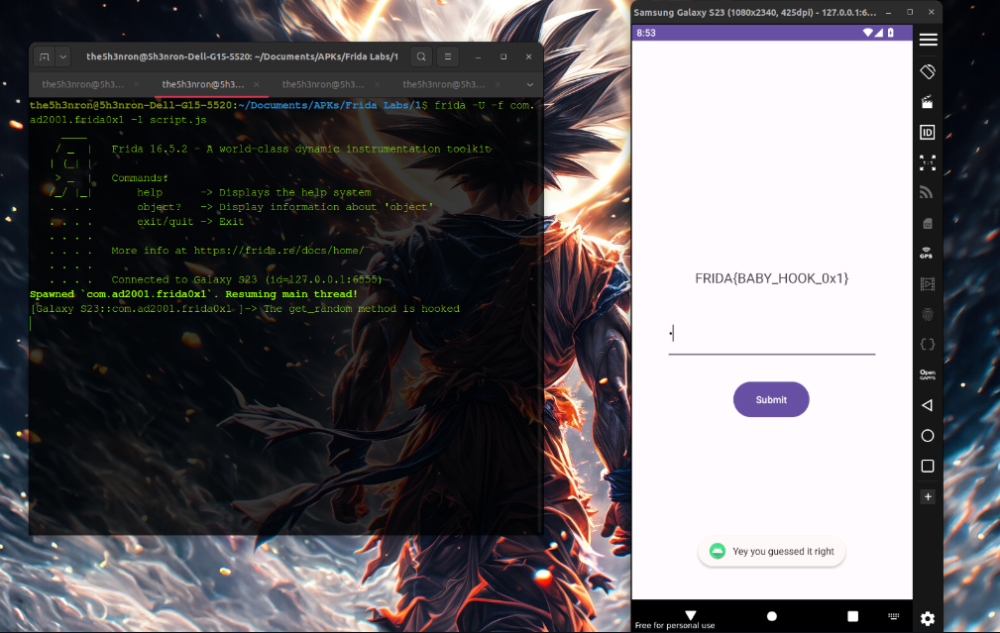

## Frida Labs Level 1 Solve

This challenge is just changing the return type of a method using frida and we get the flag.

Once we open the apk, we get a input box where we have to enter a number. From the looks of it, it seems like if we enter the right number we get the flag, else it shows "Try Again".


## Inspecting the JADX decompiled code



According to the code , the logic behind acceptance of the input is written in the "check" method. Let's inspect the check method.



The **int i** is received from the **get_random method**. Hence we have to control the behavious of the get_random method to know the input that we have to give.

Let's write a frida script to change the behaviour of the get_random method: 

```
Java.perform(function(){
	var MainClass = Java.use("com.ad2001.frida0x1.MainActivity");
	MainClass.get_random.implementation = function(){
		console.log("The get_random method is hooked");
		return 1;
	}
})
```

This overrides the get_random function and makes it **return 1**, instead of some random number. Let's run this script using frida.

```
frida -U -f com.ad2001.frida0x1 -l script.js
```

According to the app logic, the input that we have to enter is 

(i*2) + 4 = i2

As the Frida script returns 1, the input that we have to enter is **(1*2) + 4 = 6** . 



**FLAG -- FRIDA{BABY_HOOK_0x1}**
