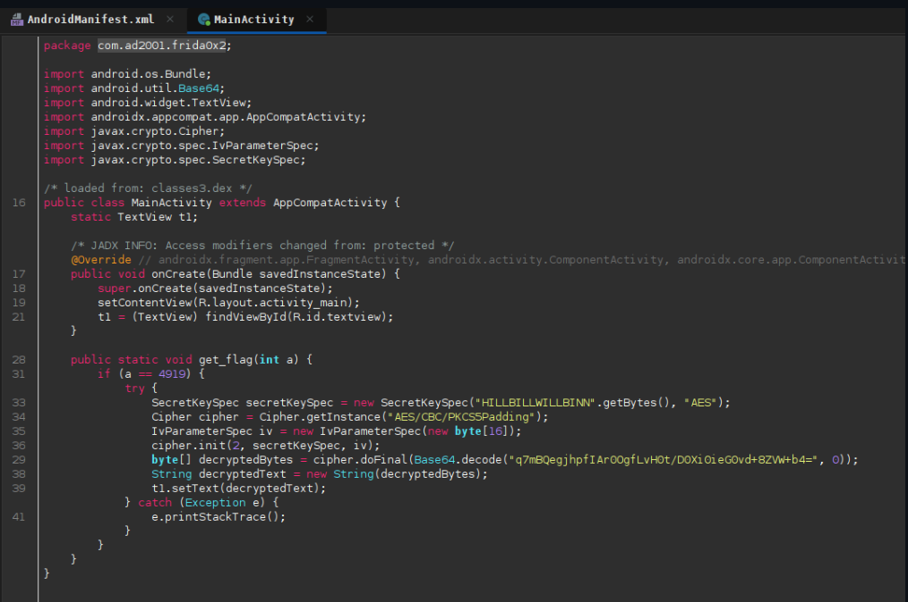
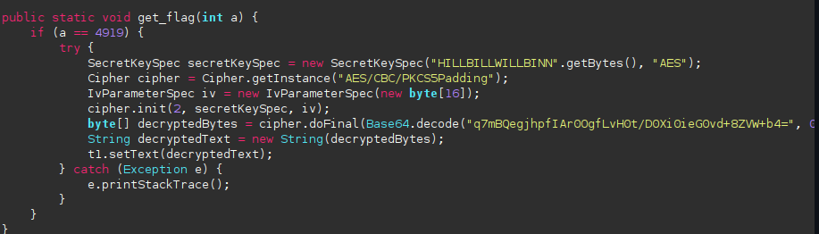
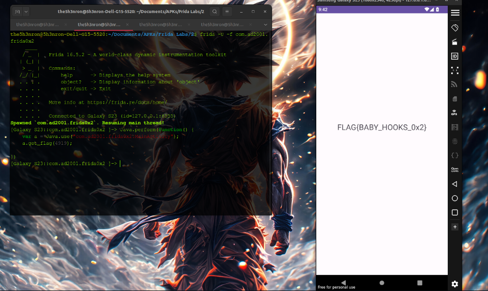

## Frida Labs Level 2 Solve

This challenge is just setting the parater of a method using frida and we get the flag.

Once we open the apk, we get a text the says "HOOK ME".

## Inspecting the JADX decompiled code



According to the code , if a = 4919, then we get the flag as a TextView.




Let's write a frida script to call the **method a** with the arguement at **4919**: 

```
Java.perform(function() {
    var a = Java.use("com.ad2001.frida0x2.MainActivity");
    a.get_flag(4919);  

})
```

Let's run this code:

```
frida -U -f com.ad2001.frida0x2 -l script.js

```


**FLAG -- FLAG{BABY_HOOKS_0x2}**
