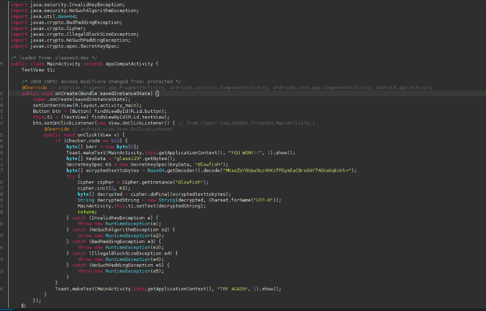
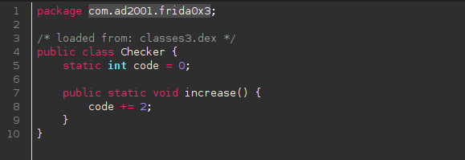
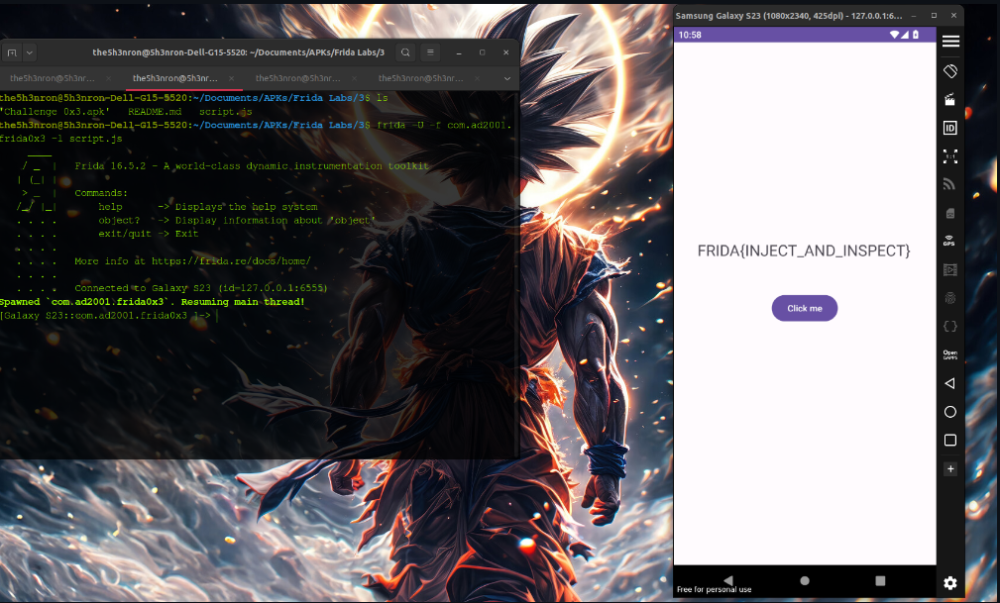

## Frida Labs Level 3 Solve

This challenge is solved by calling a class with a change in the value of a variable using frida and we get the flag.

Once we open the apk, we get a button, which when clicked might give the flag, but did not, due to some constraints.

## Inspecting the JADX decompiled code




According to the code , if the variable code in the class Checker is set to **512**, we get the flag as a TextView.




Let's write a frida script to call the **Class Checker** with the variable **code** equal to **512**: 

```
Java.perform(function(){
    var CheckClass = Java.use("com.ad2001.frida0x3.Checker");
    CheckClass.code.value = 512;
})
```

Let's run this code:

```
frida -U -f com.ad2001.frida0x2 -l script.js

```


**FLAG -- FRIDA{INJECT_AND_INSPECT}**

