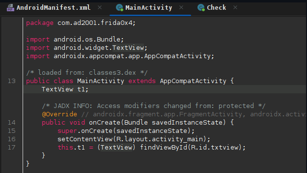
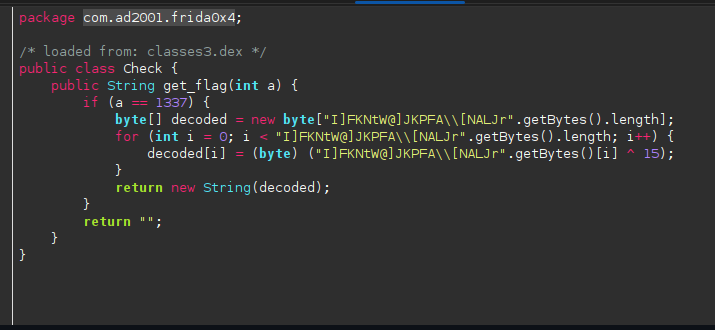
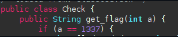
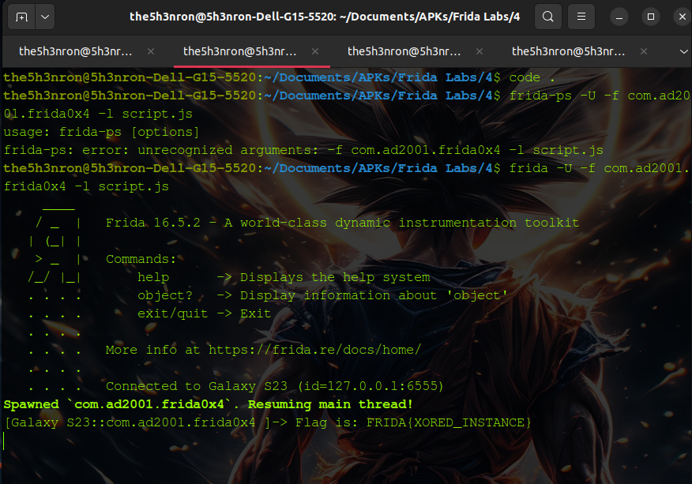

## Frida Labs Level 4 Solve

This challenge is solved by creating an object of a class which deals with flag creation and logging the flag in the terminal.

Once we open the apk, there is nothng but a text view which says "Hello Hackers :)".

## Inspecting the JADX decompiled code




According to the code , if the get_flag method is called with the arguement as **1337** the method returns the flag.




Let's write a frida script to create an object of the **Class Check** and call the method get_flag with the arguement as **1337**: 

```
Java.perform(function(){

    var CheckClass = Java.use("com.ad2001.frida0x4.Check");
    var Checkobj = CheckClass.$new();
    var flag = Checkobj.get_flag(1337);
    console.log("Flag is: "+ flag);
})
```

Let's run this code:

```
frida -U -f com.ad2001.frida0x2 -l script.js

```



**FLAG -- FRIDA{XORED_INSTANCE}**


