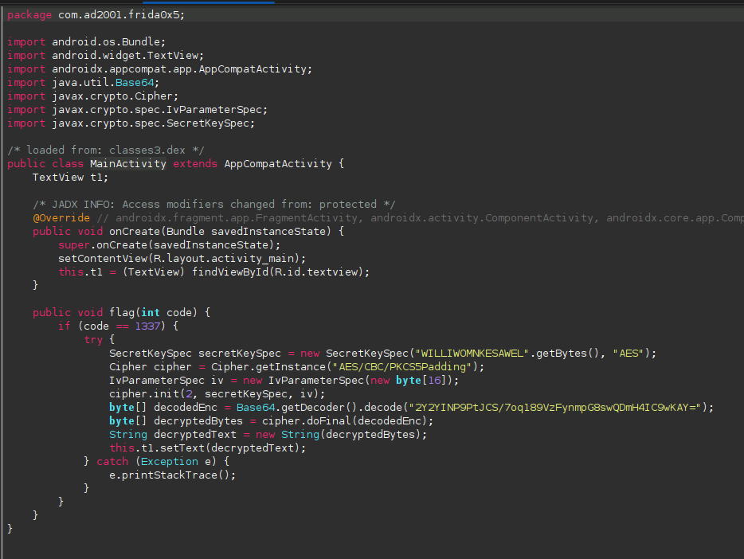
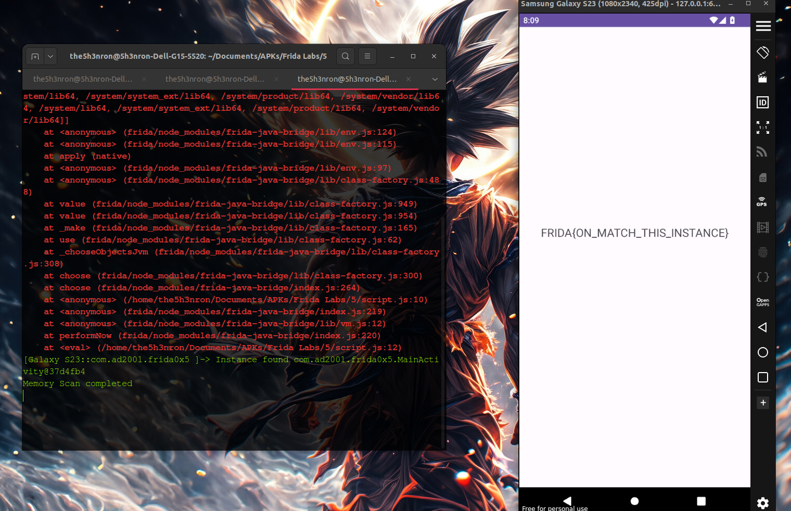

## Frida Labs Level 5 Solve

This challenge is solved by calling the object of a class and passing an arguement in a method of that class, which deals with flag creation 

Once we open the apk, there is nothng but a text view which says "Hello World".

## Inspecting the JADX decompiled code



According to the code , if the flag method is called with the arguement as **1337** the method returns the flag.


Let's write a frida script to call the object of the MainActivity class and pass the **flag emthod** with the arguement as **1337**: 

```
Java.performNow(function(){
    Java.choose("com.ad2001.frida0x5.MainActivity", {
        onMatch: function(instance){
            console.log("Instance found "+ instance);
            instance.flag(1337);
        },
        onComplete: function(){
            console.log("Memory Scan completed")
        }
    });

})

```

Let's run this code:

```
frida -U -f com.ad2001.frida0x2 -l script.js

```



**FLAG -- FRIDA{ON_MATCH_THIS_INSTANCE}**


