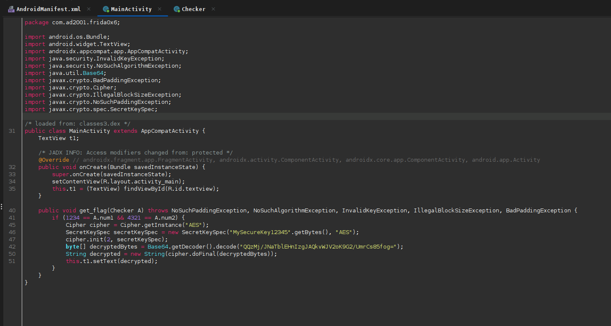
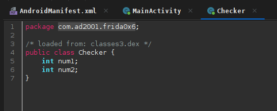
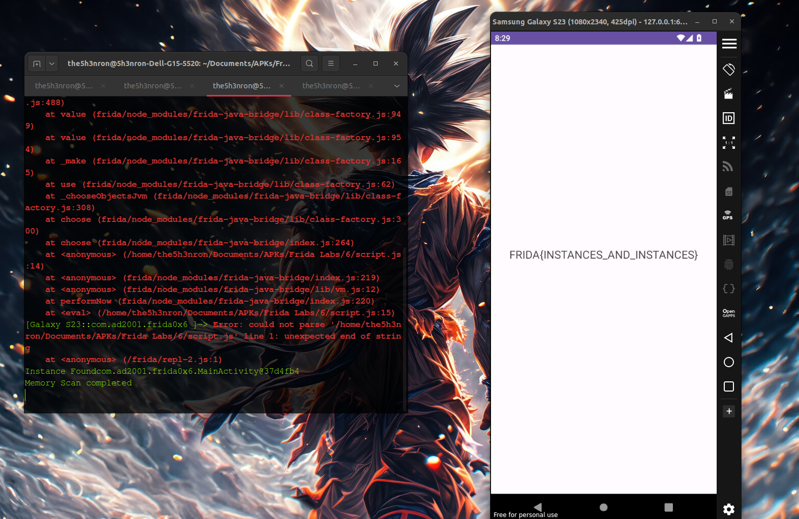

## Frida Labs Level 6 Solve

This challenge is solved by calling the object of a class returning a method of that class, which deals with flag creation . But there is a small twist.... The method contains a call from another class, which contains 2 variables, which must be assigned **2 values** to get the flag.

Once we open the apk, there is nothng but a text view which says "Hello World".

## Inspecting the JADX decompiled code




According to the code , if the flag method is called while setting the two variables in the **Checker Class**, num1 and num2 as **1234 and 4321**, we get the flag.

Let's write a frida script for the same: 

```
Java.performNow(function(){
	Java.choose('com.ad2001.frida0x6.MainActivity', {
		onMatch: function(instance){
			console.log("Instance Found" + instance);
			var CheckerClass = Java.use("com.ad2001.frida0x6.Checker");
			var Checkerobj = CheckerClass.$new();
			Checkerobj.num1.value = 1234;
			Checkerobj.num2.value = 4321;
			instance.get_flag(Checkerobj);
		},
		onComplete: function(){
			console.log("Memory Scan completed");
		}
	});
})

```

Let's run this code:

```
frida -U -f com.ad2001.frida0x2 -l script.js

```



**FLAG -- FRIDA{INSTANCES_AND_INSTANCES}**


