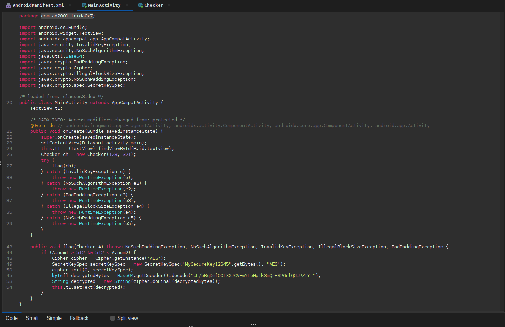
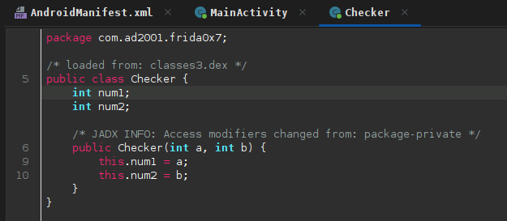
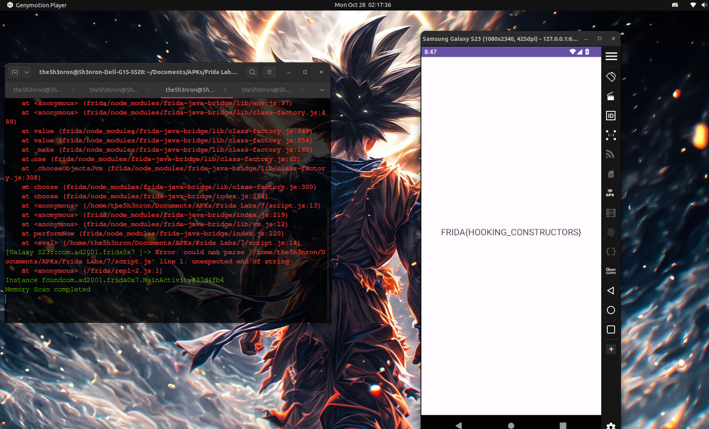

## Frida Labs Level 7 Solve

This challenge is solved by hooking a constructor and passing arguements in it, from another class which is used in the Main Class. 

Once we open the apk, there is nothng but a text view which says "Hello World".

## Inspecting the JADX decompiled code




According to the code , if the flag method is called while calling the constructor of the **Checker Class** with the parameter in such a way that **A.num1 > 512 and A.num2 > 512**, we get the flag.

Let's write a frida script for the same: 

```
Java.performNow(function(){
	Java.choose("com.ad2001.frida0x7.MainActivity", {
		onMatch: function(instance){
			console.log("Instance found"+ instance);
			var CheckerClass = Java.use("com.ad2001.frida0x7.Checker");
			var CheckerObj = CheckerClass.$new(600,600);
			instance.flag(CheckerObj);
		},
		onComplete: function() {
			console.log("Memory Scan completed");
		}

		});
});
```

Let's run this code:

```
frida -U -f com.ad2001.frida0x2 -l script.js
```



**FLAG -- FRIDA{HOOKING_CONSTRUCTORS}**


