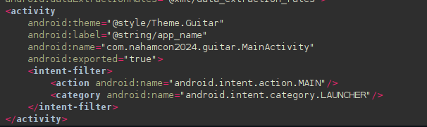
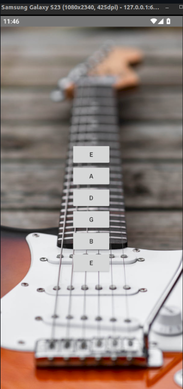
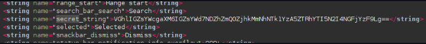
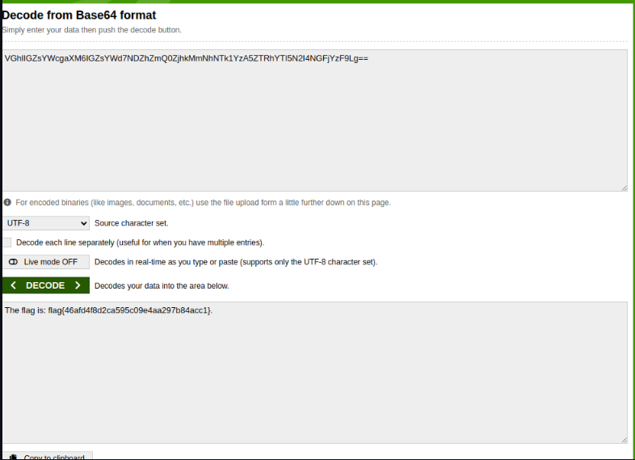

## Solve Guide: Guitar APK

This APK challenge involves analyzing a simple Android application that plays different guitar sounds when various buttons are clicked. The goal is to find and extract the hidden flag within the application.

Open the APK and check the AndroidManifest.xml. You'll notice that the app only contains a single activity, MainActivity.

Launch the app and observe its behavior. The app consists of buttons that play different guitar sounds, with no other apparent functionality or visible clues.

To locate the hidden flag, search for possible storage locations within the APK. One key file to examine is strings.xml, which is typically found in the res/values directory.

In the strings.xml file, a string labeled "secret string" was discovered. This string contains a Base64-encoded value.

### Decoding the Base64 String

To uncover the contents of the Base64 string, we use an online decoder

The decoded flag is: flag{46afd4f8d2ca595c09e4aa297b84acc1}

