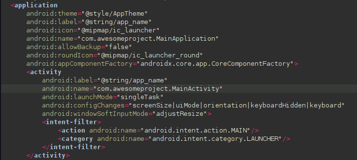
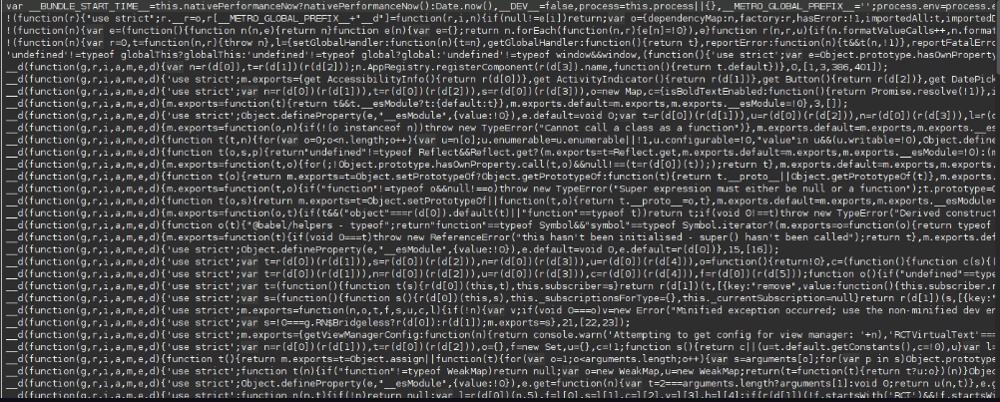
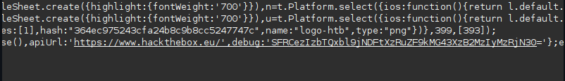
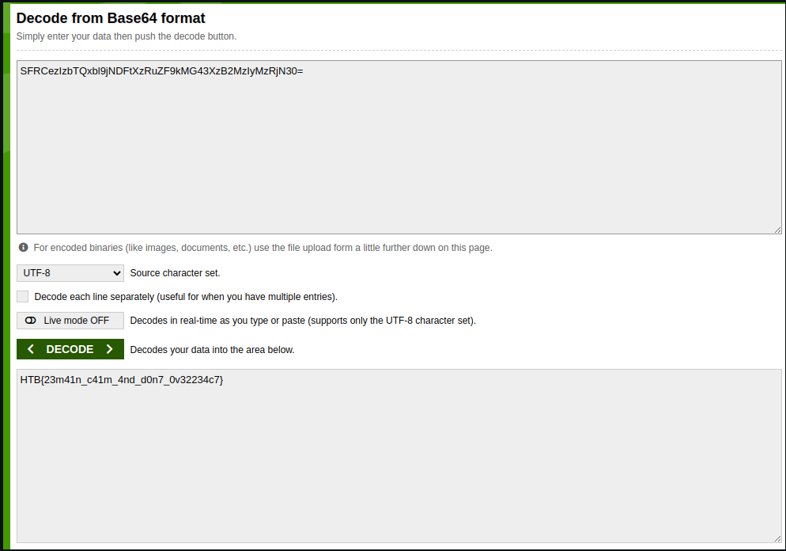

## Solve Guide: Don't Overreact APK

The "Don't Overreact" APK is a lightweight Android application with minimal functionality in the visible interface. The goal of this challenge is to extract a hidden flag embedded within the application. This guide will walk you through the complete reverse engineering process step by step

### Analyzing the MainActivity

Navigating to the MainActivity within the decompiled code reveals minimal content. The MainActivity doesn't contain any substantial logic beyond initializing the app and calling React Native components. Here’s a snippet of the code:

The app doesn’t seem to perform any local operations that could lead us to the flag. Instead, it directly relies on React Native logic, meaning that the core logic and possibly the flag are hidden within the React code.

### Investigating React Native Code
Upon deeper inspection of the index.android.bundle file located in the assets/ directory, we find a large amount of JavaScript code. This is where React Native defines its components and handles business logic.

We scan through the bundle file for any suspicious strings, comments, or variables that might indicate the presence of a flag. After searching for patterns like flag, key, or any encoded data, we come across an interesting Base64 encoded string.

### Decoding the Base64 String

To uncover the contents of the Base64 string, we use an online decoder

**Extracting the Flag**

Upon decoding the Base64 string, we uncover the message: HTB{23m41n_c41m_4nd_d0n7_0v32234c7}
