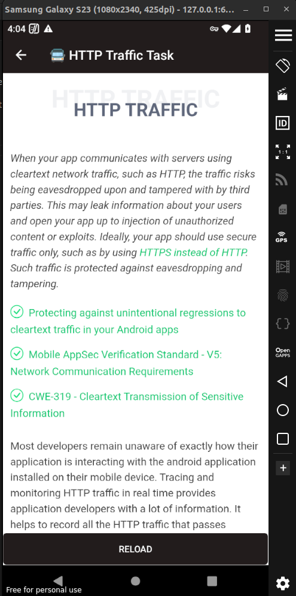
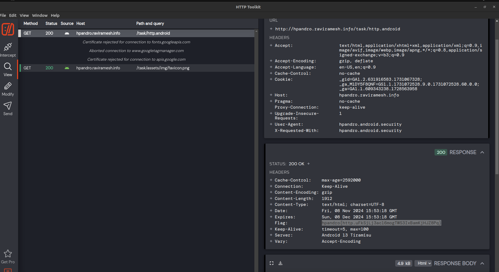

##  Solving the HTTP Traffic Level from HPAndro

The Heading literally tells us to use tools like HTTP ToolKit or BurpSuite to see the traffic in the WebView.

Once we connect the HTTP ToolKit to the GenyMotion emulator by installing the CA certificates, we just check te traffic once we open the activity, and the flag is clearly visible.

**Flag - hpandro{http.uFkSjLj3acl6mogTWS3IxBamKjHJZ8Pq}**
