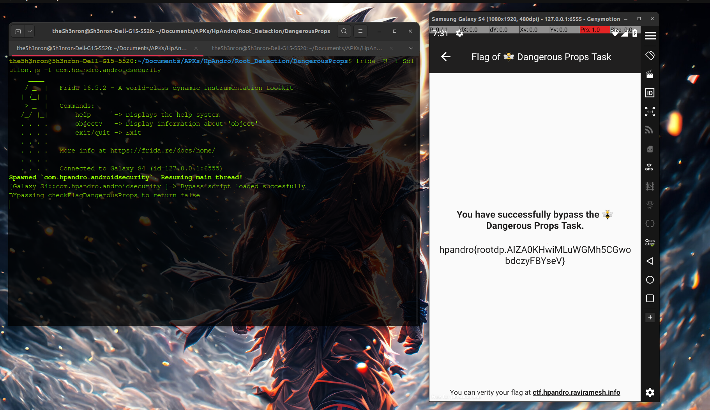

# Pre-requisites

	1. Basic knowledge of Android app structure and security mechanisms
	2. Familiarity with Frida scripting
	3. Frida installed on your computer and Android device (server running on the Android device)

# Target App Overview

The target app detects if the device has dangerous properties (ro.debuggable and ro.secure flags) set

	1. checkFlagDangerousProps()
 		The checkFlagDangerousProps function uses a hardcoded HashMap of "dangerous" properties (ro.debuggable and ro.secure). It reads properties from the device using propsReader() (which  
 		fetches system properties with the command getprop).For each property, it checks if its value matches the expected values in the HashMap. If any property is "dangerous," it sets a flag.

**My goal was to intercept and modify the method to prevent the app from detecting dangerous properties.**

# Bypassing Properties detection Using Frida

To bypass this "dangerous" detection, we’ll intercept the relevant methods and modify their behavior at runtime using Frida. Here’s the Frida script that accomplishes this:

```
Java.perform(function(){
    var DangerousProps = Java.use("com.hpandro.androidsecurity.ui.activity.task.rootDetection.DangerousPropsTaskActivity");

    DangerousProps.checkFlagDangerousProps.implementation = function(){
            console.log("BYpassing checkFlagDangerousProps to return false");
            return false;
    };

    console.log("Bypass script loaded succesfully");
})

```
## Explanation:

**Java.use:** This Frida function allows access to the Java class RootManagementTaskActivity, where the root detection logic resides.

**Hooking checkFlagDangerousProps():** This code hooks the checkFlagDangerousProps method in the DangerousPropsTaskActivity class, replacing its original behavior. By implementing this function, it effectively bypasses the original method’s security check and instead returns false to indicate that no dangerous properties were found, which likely allows the app to proceed as if the device is secure.

## Step-by-step Script Execution:



To inject this script into the target app, use the following Frida command: **(make sure that the frida server is running in the emulator)**

```
frida -U -l Solution.js -f hpandro.android.security 
```
Once injected, Frida will intercept the root detection methods and prevent the app from detecting that the device is rooted.

**Flag - hpandro{rootdp.AIZA0KHwiMLuWGMh5CGwobdczyFBYseV}**

