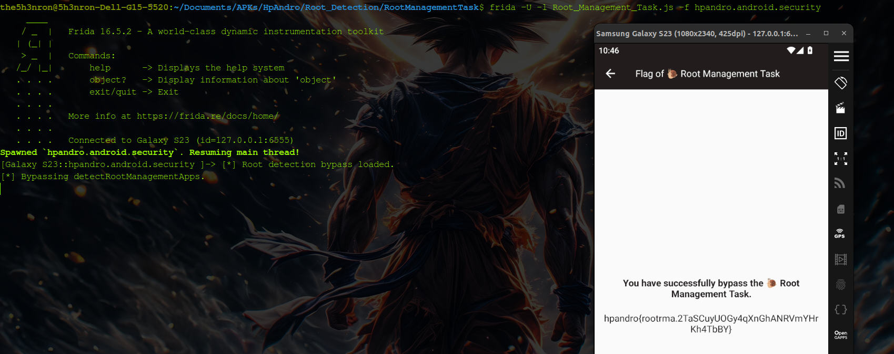

# Pre-requisites

	1. Basic knowledge of Android app structure and security mechanisms
	2. Familiarity with Frida scripting
	3. Frida installed on your computer and Android device (server running on the Android device)

# Target App Overview

The target app employs root detection by looking for specific root management apps installed on the device. This is done using two key methods in the class RootManagementTaskActivity:

	1. isAnyPackageFromListInstalled()
	This method checks if any known root management apps (like Magisk, KingRoot, etc.) are installed by querying the Android Package Manager.

	2. detectRootManagementApps()
	This method consolidates the root detection process by calling isAnyPackageFromListInstalled() to determine if any root apps are present.

**My goal was to intercept and modify these methods to prevent the app from detecting root management apps.**

# Bypassing Root Detection Using Frida

To bypass root detection, we’ll intercept the relevant methods and modify their behavior at runtime using Frida. Here’s the Frida script that accomplishes this:

```
Java.perform(function () {
    var RootManagementTaskActivity = Java.use("hpandro.android.security.ui.activity.task.rootDetection.RootManagementTaskActivity");

    RootManagementTaskActivity.isAnyPackageFromListInstalled.implementation = function (packages) {
        console.log("[*] Root check is being bypassed.");

        for (var i = 0; i < packages.length; i++) {
            console.log("[*] Checking package: " + packages[i]);
        }

        return false;
    };

    RootManagementTaskActivity.detectRootManagementApps.implementation = function (context, apps) {
        console.log("[*] Bypassing detectRootManagementApps.");
        
        return false;
    };

    console.log("[*] Root detection bypass loaded.");
});

```
## Explanation:

**Java.use:** This Frida function allows access to the Java class RootManagementTaskActivity, where the root detection logic resides.

**Hooking isAnyPackageFromListInstalled():** This method checks if specific root management apps like Magisk, KingRoot, etc., are installed by querying the Android Package Manager. We intercept this method and make it return false regardless of the actual packages installed on the device.

The script logs each package being checked by the app, which can be useful for understanding which root management apps the app is trying to detect.
By returning false, the app is tricked into thinking none of the root management apps are installed.

**Hooking detectRootManagementApps():** This method coordinates the root detection process by calling the package-checking function. By hooking into it, we ensure that the app never detects any root apps by always returning false, effectively bypassing the root detection mechanism.

## Step-by-step Script Execution:



To inject this script into the target app, use the following Frida command: **(make sure that the frida server is running in the emulator)**

```
frida -U -l Root_Management_Task.js -f hpandro.android.security 
```
Once injected, Frida will intercept the root detection methods and prevent the app from detecting that the device is rooted.


**Flag - hpandro{rootrma.2TaSCuyUOGy4qXnGhANRVmYHrKh4TbBY}**
