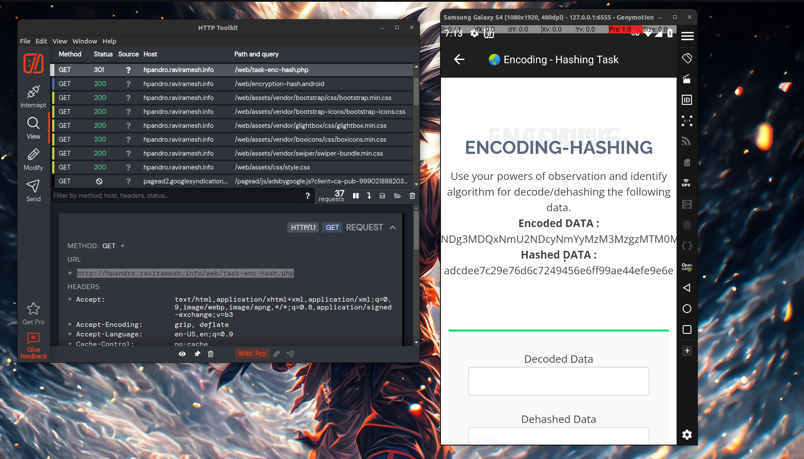
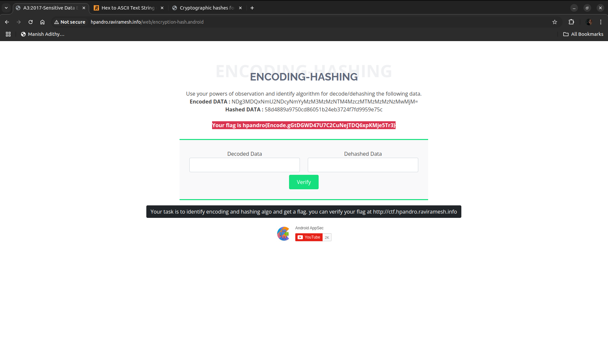

The task provided a web view of a webpage within the app, with obvious hints indicating that the solution involves decryption and decoding.

## Step 1: Intercepting the Webpage Link

To access the webpage in a browser, I used HTTP Toolkit to capture the network traffic from the app and locate the webpage link. This led me to the following URL:

**URL: http://hpandro.raviramesh.info/web/task-enc-hash.php**

## Step 2: Inspecting the webpage 

After opening the page in a browser, I decoded the string given in the website:

**NDg3MDQxNmU2NDcyNmYyMzM3MzMzNTM4MzczMTMzMzMzNzMwMjM=** ----> (base64) ----> 4870416e64726f233733353837313333373023 -----> (hex to ascii) ------> HpAndro#7358713370#

Next is the decryption, i directly pasted the hash in google and got the cracked value ---> **asimov**

On entering these values, i got the flag straight away.

## Flag
The flag was displayed on the screen:
**Flag - hpandro{Encode.gGtDGWD47U7C2CuNejTDQ6xpKMje5Tr3}**
