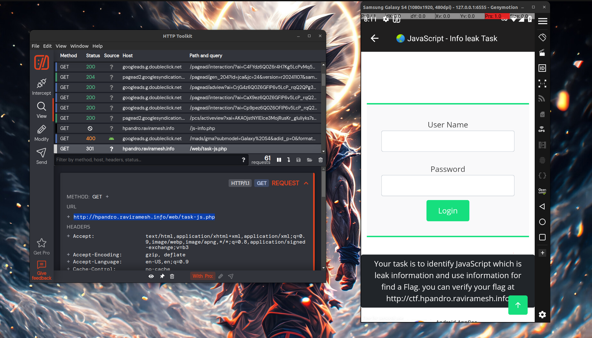
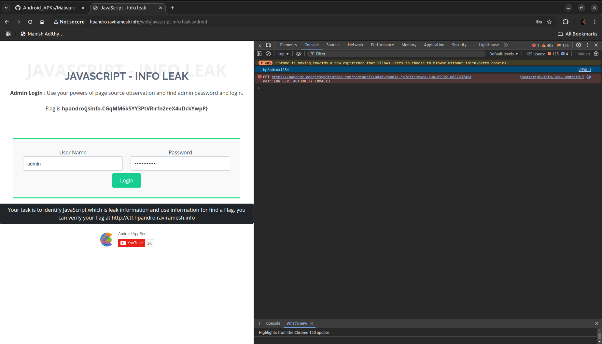

The task provided a web view of a webpage within the app, with obvious hints indicating that it has something to do with JavaScript.

## Step 1: Intercepting the Webpage Link

To access the webpage in a browser, I used HTTP Toolkit to capture the network traffic from the app and locate the webpage link. This led me to the following URL:

**URL: http://hpandro.raviramesh.info/web/task-enc-hash.php**



## Step 2: Inspecting the JS code

```
eval(function(p, a, c, k, e, d) {
    e = function(c) {
        return c
    }
    ;
    if (!''.replace(/^/, String)) {
        while (c--) {
            d[c] = k[c] || c
        }
        k = [function(e) {
            return d[e]
        }
        ];
        e = function() {
            return '\\w+'
        }
        ;
        c = 1
    }
    ;while (c--) {
        if (k[c]) {
            p = p.replace(new RegExp('\\b' + e(c) + '\\b','g'), k[c])
        }
    }
    return p
}('3.2(\'1#0\');', 4, 4, '1234|hpAndro|log|console'.split('|'), 0, {}))

```

This code when understood, returns, **console.log("hpAndro#1234")**

I went straight to the console page and found a string **hpAndro#1234**.

On entering username as **admin** and password as **hpAndro#1234**, i got the flag straight away.



## Flag
The flag was displayed on the screen:
**Flag - hpandro{jsInfo.CGqMM6kSYY3PtVRirfn2eeX4uDckYwpP}**
