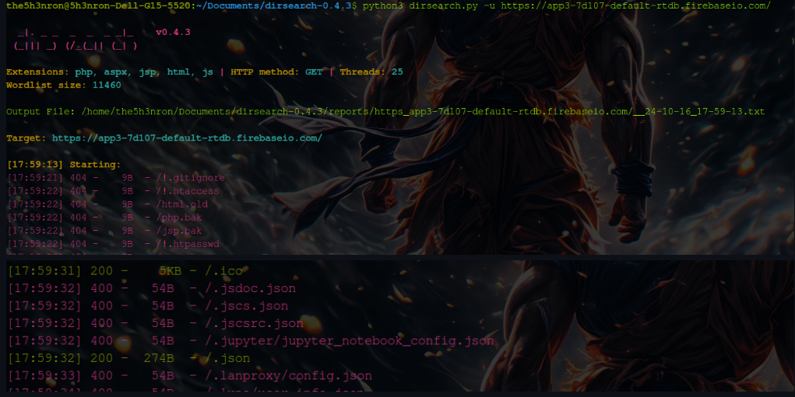

It was a fun mix of Adnroid reverse engineering and exploring the URL endpoints, leading to an unexpected twist that unlocked the flag. Let's dive in!

# Initial Observations

As usual, I started by inspecting the **AndroidManifest.xml**. It showed just one activity — MainActivity, which seemed straightforward. Launching the app presented a simple dice interface, with a button labeled "Roll Dice." Every time I clicked the button, a random dice number would appear.

``` 
<activity
            android:name="com.example.app3.MainActivity"
            android:exported="true">
            <intent-filter>
                <action android:name="android.intent.action.MAIN"/>
                <category android:name="android.intent.category.LAUNCHER"/>
            </intent-filter>
        </activity>
```

Curiosity led me to inspect the MainActivity code. Here's where I made my first discovery: the number of clicks was important. If I clicked the button exactly 9999999 times, a toast message would display the flag. 

```
if (MainActivity.this.count.intValue() == 9999999) {
                    MainActivity.this.mDatabase.child(MainActivity.this.path1 + MainActivity.this.path2 + MainActivity.this.path3 + MainActivity.this.path4 + MainActivity.this.path5).get().addOnCompleteListener(new OnCompleteListener<DataSnapshot>() { // from class: com.example.app3.MainActivity.1.1
                        @Override // com.google.android.gms.tasks.OnCompleteListener
                        public void onComplete(Task<DataSnapshot> task) {
                            if (!task.isSuccessful()) {
                                Toast.makeText(MainActivity.this, "Oops Something went wrong", 0).show();
                            } else {
                                Toast.makeText(MainActivity.this, "Congratulations!! You know where the flag is.", 0).show();
                            }
                        }
                    });
                }
```

Clearly, there had to be an easier way than manually clicking the button millions of times, so I considered two possible approaches:

# Two Potential Paths

## Using Frida to Manipulate Variables:

With Frida, I could easily intercept the app's logic and set the number of clicks directly to 9999999. This would trigger the flag immediately. This method seemed efficient, allowing me to bypass the app's logic in real-time.

## Modifying the APK Using Smali:

Alternatively, I could decompile the APK, navigate to the code responsible for checking the number of clicks, and modify the app to set the number directly to 1 instead of 9999999. By patching the app and reinstalling the modified APK, the flag would appear after just one click.

But then, I noticed something intriguing...

# A New Approach: Firebase Investigation

While exploring the app, I realized the flag was being fetched from a Firebase URL. 

```
import com.google.firebase.database.DatabaseReference;
import com.google.firebase.database.FirebaseDatabase;

/* loaded from: classes.dex */
public class MainActivity extends AppCompatActivity {
    Integer count = 0;
    ImageView diceimg;
    TextView dicetext;
    private DatabaseReference mDatabase;
    String path1;
    String path2;
    String path3;
    String path4;
    String path5;
    Button rollbut;
```

I quickly navigated to the strings.xml file, where I found the Firebase URL, "https://app3-7d107-default-rtdb.firebaseio.com/"

At this point, I wondered: Could there be any open endpoints or exposed data on this Firebase instance?

# Dirsearch for the Win

To investigate further, I ran dirsearch on the Firebase URL to check for any accessible endpoints. To my surprise, I found something at the evergreen /.json extension. 



And there it was—the flag, exposed in plain text!

# The Flag

Accessing this open .json endpoint allowed me to retrieve the flag directly, bypassing both the dice game logic and any modification of the app itself.

```
{
  "flag": "ironCTF{fak3_f1ag}",
  "please": {
    "f1": "ironCTF{",
    "f2": "1s_th",
    "f3": "15_7h3_",
    "f4": "r1ght",
    "f5": "fl4g}",
    "give": {
      "me": {
        "the": {
          "flag": {
            "f1": "ironCTF{",
            "f2": "y0u_pu",
            "f3": "7_0u7_t",
            "f4": "h3_f1",
            "f5": "r3_1n_t",
            "f6": "h3_b4s",
            "f7": "3_c4mp",
            "f8": "_1f84a5",
            "f9": "c66ff5}"
          }
        }
      }
    }
  }
}
```

**ironCTF{y0u_pu7_0u7_th3_f1r3_1n_th3_b4s3_c4mp_1f84a5c66ff5}**

