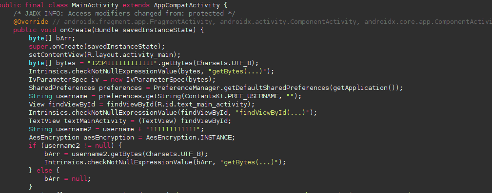
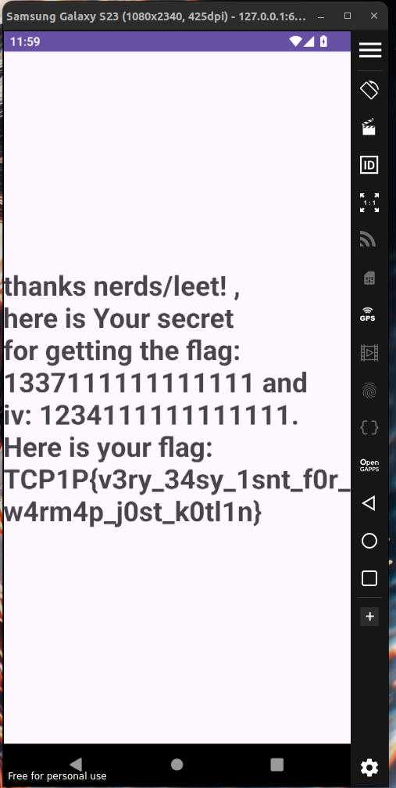

## Cracking the Android Encryption Challenge

This repository contains the solution to an Android encryption challenge, where a flag is hidden behind a username and password combination. The challenge utilizes AES encryption and requires careful analysis of the provided code to uncover the decryption key.

### Understanding the Challenge

**Encryption Method:** The app utilizes AES (Advanced Encryption Standard) encryption, a widely used symmetric encryption algorithm.

**Key Generation:** The decryption key appears to be derived from the username stored in the device's shared preferences and a predefined constant string. This approach creates a unique key for each user.

**IV (Initialization Vector):**  A constant IV is used in the encryption process. While convenient for demonstration purposes, a random IV should be used in real-world scenarios for better security.

### Solution Approach

1. **Code Analysis:** Examine the `MainActivity.java` file to understand the encryption logic, key generation, and output conditions.

2. **Username Analysis:** Identify the role of the username in the decryption process. The hint suggests that the username is part of the key.

3. **IV Identification:** Confirm the use of the predefined IV in the decryption process.

4. **Key Construction:** Concatenate the username with a predefined constant string to form the decryption key.

### Steps to Solve

1. **Retrieve the Username:** Obtain the username from the app's shared preferences.

2. **Construct the Key:** Combine the username with the predefined constant to form the decryption key.

3. **Decrypt the Flag:** Use the constructed key and the predefined IV to decrypt the encrypted flag using the AES algorithm in CBC mode.

**Code Implementation (Java):**

**This condition hints that the correct username should be "1337". The password is generated by appending "111111111111" to the username, resulting in the key 1337111111111111.**

Username: 1337
Password: 1337111111111111

**After entering the correct username and password, the app proceeds to decrypt the ciphertext using the following parameters:**

Secret Key: 1337111111111111 (derived from the username).

IV: 1234111111111111.

The decrypted flag is then displayed on the screen.

**FLAG - TCP1P{v3ry_34sy_1snt_f0r_w4rm4p_j0st_k0tl1n}**

