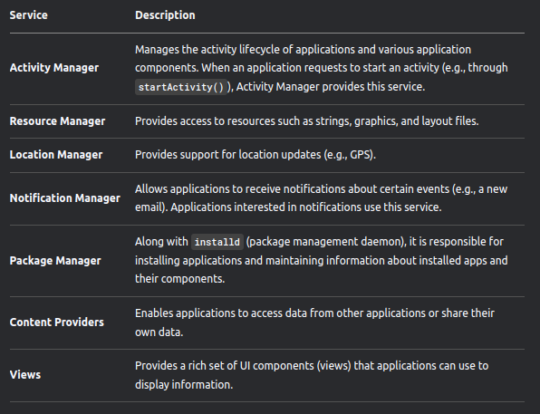

# Android Architecture Overview

Android can be considered as a software stack with the following layers:

1. **Linux Kernel**
2. **Libraries and Runtime** → Dalvik Virtual Machine and Android Core Libraries
3. **Application Framework** → Enables Android to interact with the native libraries and kernel
4. **Applications** → Normal Apps in the phone

## Linux Kernel

- Android does not use the traditional Linux system like Ubuntu. Instead, the Android team forked the Linux kernel and modified it for embedded environments.
- The Android team maintains this fork and incorporates changes from the main Linux kernel for future Android releases.
- Linux provides a solid foundation for Android, offering hardware abstraction, drivers, security, process, and memory management.

Below is a table that provides the Android version with its respective Linux versions:

## Libraries

- Android includes a set of C and C++ libraries used by different system components. Developers access these through the Android application framework.
- This layer is often called the **"native layer"** because the code is written in C and C++, optimized for hardware, unlike Android apps and frameworks, which are Java-based.
- Android applications can access native capabilities through Java Native Interface (**JNI**) calls.
- Most libraries are used without modification, except for **Bionic** (System C library), a trimmed-down version of `libc` optimized for embedded platforms under the BSD license.

### Android Native Layer Libraries:

## Android Runtime

### Android Runtime = Dalvik VM + Core Libraries

- Android applications are written in Java and compiled into Java class files.
- However, Android does not directly run Java class files; instead, they are compiled into **DEX format**, executable by the Dalvik Virtual Machine (**DVM**).
- Unlike the Java Virtual Machine (**JVM**), which runs `.class` files directly, Android requires this additional step.

- Android includes a set of **Core Libraries** that provide most of the functionality available in Java APIs.
- However, these APIs are a **trimmed-down** version of J2SE, lacking Swing and AWT, but including Android-specific libraries such as SQLite and OpenGL.
- Using **J2ME** would have **licensing and security implications**:
  - Licensing fees to Oracle for each device.
  - In J2ME, all applications run inside **one VM**, leading to weaker security.
  - In Android, each application runs in its own **isolated VM**, enhancing security.

## Application Framework

- The **Android Application Framework** provides a set of Java API classes for application development.
- These APIs are accessed through various **Application Manager Services**.
- Below is an image that provides an overview of the available resources.

## Android Startup and Zygote

- Like most **Linux-based** systems, the bootloader loads the **Linux kernel** (modified for Android) and starts the **init process**.
- The **init process** spawns system daemons (e.g., `adb` daemon, USB daemons, and other hardware daemons).
- After launching daemons, `init` starts the **Zygote process**, which:
  1. Launches the first **Dalvik VM** and preloads all core Java classes used by applications.
  2. Listens on a socket for future requests to spawn new DVMs.
- When a new application is launched:
  - **Zygote forks itself**, creating a new process with an initialized VM  - This avoids slowdowns as shared libraries are **not copied** unless modified.
- Once **Zygote** starts, it forks a **System Server** process, which launches core Android services such as **Activity Manager**.
- After launching core services, the system is ready to start user applications.

## Android Tools

- Below is an image of the Android tools available through SDK.

## DDMS

- The emulator enables us to view an application's behaviour at a UI level. However, to understand what's going on under the surface, we need the DDMS.
- The DDMS is a powerful tool that allows us to obtain detailed information or running processes, review stack and hap info, explore the file system of the emulator, and more

## ADB

- ADB is a client-server applicatn that provices us with a way to communicate with an emulator/device. 
- It contains 3 components : 

1. ADB daemon (/sbin/adbd)-> which runs on the device/emulator
2. service -> which runs on the development system
3. client applications (adb/ddms) -> which are used to communicate to the daemon through the service.

For adb commands, you can refer this notion page: https://lu77-u.notion.site/Commands-38069262b2584aa1a658be807dc3f3f8

## ProGuard

- ProGuard is a code-obfuscation tool that is a part of the Android SDK. Since Java classes can be easily decompiled, it is a good idea to perform code-obfuscation as part of the development and building of an applcation.
- The Proguard tool, shriks, optimizes, and obfuscates code by removing unused codes as well as renaming classes, fields, and methods.
- This can inrease the time required to reverse engineer an applcation by someone else. 

## Understanding the Android Application folder

Below is the image , which givesa  good overview about the different folders in an Android application:

## ANDROID ARCHITECTURE

## Application Components

There are 4 main components of an Android application: 

1. Activities
2. Broadcast Receivers
3. Content Providers
4. Services

These components interact with each other through Intents.

## Activities

- Activities are basically screens that the user sees and interacts with visually.
- One has to create a subclass of the "activity" class to create an activity. 
- In this class, one has to override relavent callback methods that will be called when an activity is created, transitioned (paused, stopped, sent into the background), or destroyed
- There are multiple callback methods, but the most important ones are OnCreate and OnPause. 

OnCreate() -> This is where an activity is initialized, and every activity class implements this method. 
              Usually, setContentView(Int) is called within OnCreate() and deines the UI of the screen/activity.
              findViewById(Int) is used to find resources and interact with them programmatically.

OnPause() ->  If a user decides to leave an activity, the saving of the state or imporant operations are performed by this method.

Other importnat methods are OnStart(), OnRestart(), OnResume(), OnStop and OnDestroy().

Below is the example image of the code in an OnCreate function:

### Intents

- Intents are messages through which other application components (activities, services and Broadcast Receivers) are activated. They can be  thought of as messages stating which oper>
- Intnts themselves are objects containing information on operations to be performed or, in the case of Broadcast Receivers, on details of an event that occured.
- Intent is a data structure desgined to hold information on events or operations to be performed. Intents contain two primary pieces of information:
  - Action to be performed
  - Data on which action will be performed, expressed as Uniform Resource Identifier (URI)

**METHODS DELIVERING INTENTS TO COMPONENTS**

1. Activity - Context.startActivity()Activity.startActivityForResult()
2. Service - Context.startService()Context.bindService()
3. Broadcast Receivers - Context.sendBroadcast()Context.sendOrderedBroadcase()

There are other pieces of information tha can be provided in an Intent:

1. **Category** - provides information on the category of action. If it is set to CATEGORY_LAUNCHED, this activity will appear in the application launcher.
2. **Type** - provides explicit type of Intent data (thus bypassing built-in evaluation)
3. **Component** - provides name of the component that will handle the Intent. This is not a required field. If it is empty, other information provided in the bundle will be used to >
4. **Extras** - any additional information that needs to provided. These extra pieces of information through android.os.Bundle.

Intents can be classified into 2 types : 

1. Explicit 
2. Implicit

1. Explicit Intents provide the component name (class name) that must be invoked through the Intent. This is usually for inter-application components, since other application would not typically know the component names.
   - Intent i = new Intent(this, <activity_name>.class);

2. Implicit Intents, on the other hand are used to invoke components of different applications ( e.g., a photo application sending an e-mail intent to the e-mail application to send a photo through an e-mail). They do not provide the specific component name to be invoked but rely on the system to find the best available component to be invoked.For this to be possible, each component can provide Intent-filters. 
   - Intent filters are structures that provide information on which Intents can be handled by particular components.
   - Intent filters provide a way to specify which Intents a component through implicit intent.
   - Typical implicit intent :- Intent I = new Intent(Intent.ACTION_VIEW,Uri.parse (http://www.google.com));

The Intent field and their descriptions are as follows

An Example of an Intent declaration in the Manifest.xml file

## Broadcast Receivers

