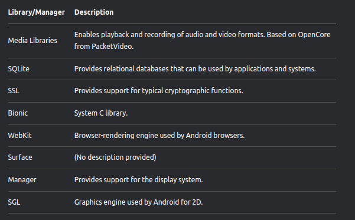

# Android Architecture Overview (Chapter 2)

Android can be considered as a software stack with the following layers:

1. **Linux Kernel**
2. **Libraries and Runtime** → Dalvik Virtual Machine and Android Core Libraries
3. **Application Framework** → Enables Android to interact with the native libraries and kernel
4. **Applications** → Normal Apps in the phone

## Linux Kernel

- Android does not use the traditional Linux system like Ubuntu. Instead, the Android team forked the Linux kernel and modified it for embedded environments.
- The Android team maintains this fork and incorporates changes from the main Linux kernel for future Android releases.
- Linux provides a solid foundation for Android, offering hardware abstraction, drivers, security, process, and memory management.

Below is a table that provides the Android version with its respective Linux versions:

## Libraries

- Android includes a set of C and C++ libraries used by different system components. Developers access these through the Android application framework.
- This layer is often called the **"native layer"** because the code is written in C and C++, optimized for hardware, unlike Android apps and frameworks, which are Java-based.
- Android applications can access native capabilities through Java Native Interface (**JNI**) calls.
- Most libraries are used without modification, except for **Bionic** (System C library), a trimmed-down version of `libc` optimized for embedded platforms under the BSD license.

### Android Native Layer Libraries:

## Android Runtime

### Android Runtime = Dalvik VM + Core Libraries

- Android applications are written in Java and compiled into Java class files.
- However, Android does not directly run Java class files; instead, they are compiled into **DEX format**, executable by the Dalvik Virtual Machine (**DVM**).
- Unlike the Java Virtual Machine (**JVM**), which runs `.class` files directly, Android requires this additional step.

- Android includes a set of **Core Libraries** that provide most of the functionality available in Java APIs.
- However, these APIs are a **trimmed-down** version of J2SE, lacking Swing and AWT, but including Android-specific libraries such as SQLite and OpenGL.
- Using **J2ME** would have **licensing and security implications**:
  - Licensing fees to Oracle for each device.
  - In J2ME, all applications run inside **one VM**, leading to weaker security.
  - In Android, each application runs in its own **isolated VM**, enhancing security.

## Application Framework

- The **Android Application Framework** provides a set of Java API classes for application development.
- These APIs are accessed through various **Application Manager Services**.
- Below is an image that provides an overview of the available resources.

## Android Startup and Zygote

- Like most **Linux-based** systems, the bootloader loads the **Linux kernel** (modified for Android) and starts the **init process**.
- The **init process** spawns system daemons (e.g., `adb` daemon, USB daemons, and other hardware daemons).
- After launching daemons, `init` starts the **Zygote process**, which:
  1. Launches the first **Dalvik VM** and preloads all core Java classes used by applications.
  2. Listens on a socket for future requests to spawn new DVMs.
- When a new application is launched:
  - **Zygote forks itself**, creating a new process with an initialized VM  - This avoids slowdowns as shared libraries are **not copied** unless modified.
- Once **Zygote** starts, it forks a **System Server** process, which launches core Android services such as **Activity Manager**.
- After launching core services, the system is ready to start user applications.

## Android Tools

- Below is an image of the Android tools available through SDK.

## DDMS

- The emulator enables us to view an application's behaviour at a UI level. However, to understand what's going on under the surface, we need the DDMS.
- The DDMS is a powerful tool that allows us to obtain detailed information or running processes, review stack and hap info, explore the file system of the emulator, and more

## ADB

- ADB is a client-server applicatn that provices us with a way to communicate with an emulator/device. 
- It contains 3 components : 

1. ADB daemon (/sbin/adbd)-> which runs on the device/emulator
2. service -> which runs on the development system
3. client applications (adb/ddms) -> which are used to communicate to the daemon through the service.

For adb commands, you can refer this notion page: https://lu77-u.notion.site/Commands-38069262b2584aa1a658be807dc3f3f8

## ProGuard

- ProGuard is a code-obfuscation tool that is a part of the Android SDK. Since Java classes can be easily decompiled, it is a good idea to perform code-obfuscation as part of the development and building of an applcation.
- The Proguard tool, shriks, optimizes, and obfuscates code by removing unused codes as well as renaming classes, fields, and methods.
- This can inrease the time required to reverse engineer an applcation by someone else. 

## Understanding the Android Application folder

Below is the image , which givesa  good overview about the different folders in an Android application:

## ANDROID ARCHITECTURE (Chapter 3)

## Application Components

There are 4 main components of an Android application: 

1. Activities
2. Broadcast Receivers
3. Content Providers
4. Services

These components interact with each other through Intents.

## Activities

- Activities are basically screens that the user sees and interacts with visually.
- One has to create a subclass of the "activity" class to create an activity. 
- In this class, one has to override relavent callback methods that will be called when an activity is created, transitioned (paused, stopped, sent into the background), or destroyed
- There are multiple callback methods, but the most important ones are OnCreate and OnPause. 

OnCreate() -> This is where an activity is initialized, and every activity class implements this method. 
              Usually, setContentView(Int) is called within OnCreate() and deines the UI of the screen/activity.
              findViewById(Int) is used to find resources and interact with them programmatically.

OnPause() ->  If a user decides to leave an activity, the saving of the state or imporant operations are performed by this method.

Other importnat methods are OnStart(), OnRestart(), OnResume(), OnStop and OnDestroy().

Below is the example image of the code in an OnCreate function:

### Intents

- Intents are messages through which other application components (activities, services and Broadcast Receivers) are activated. They can be  thought of as messages stating which oper>
- Intnts themselves are objects containing information on operations to be performed or, in the case of Broadcast Receivers, on details of an event that occured.
- Intent is a data structure desgined to hold information on events or operations to be performed. Intents contain two primary pieces of information:
  - Action to be performed
  - Data on which action will be performed, expressed as Uniform Resource Identifier (URI)

**METHODS DELIVERING INTENTS TO COMPONENTS**

1. Activity - Context.startActivity()Activity.startActivityForResult()
2. Service - Context.startService()Context.bindService()
3. Broadcast Receivers - Context.sendBroadcast()Context.sendOrderedBroadcase()

There are other pieces of information tha can be provided in an Intent:

1. **Category** - provides information on the category of action. If it is set to CATEGORY_LAUNCHED, this activity will appear in the application launcher.
2. **Type** - provides explicit type of Intent data (thus bypassing built-in evaluation)
3. **Component** - provides name of the component that will handle the Intent. This is not a required field. If it is empty, other information provided in the bundle will be used to >
4. **Extras** - any additional information that needs to provided. These extra pieces of information through android.os.Bundle.

Intents can be classified into 2 types : 

1. Explicit 
2. Implicit

1. Explicit Intents provide the component name (class name) that must be invoked through the Intent. This is usually for inter-application components, since other application would not typically know the component names.
   - Intent i = new Intent(this, <activity_name>.class);

2. Implicit Intents, on the other hand are used to invoke components of different applications ( e.g., a photo application sending an e-mail intent to the e-mail application to send a photo through an e-mail). They do not provide the specific component name to be invoked but rely on the system to find the best available component to be invoked.For this to be possible, each component can provide Intent-filters. 
   - Intent filters are structures that provide information on which Intents can be handled by particular components.
   - Intent filters provide a way to specify which Intents a component through implicit intent.
   - Typical implicit intent :- `Intent I = new Intent(Intent.ACTION_VIEW,Uri.parse (http://www.google.com));`

The Intent field and their descriptions are as follows

An Example of an Intent declaration in the Manifest.xml file

## Broadcast Receivers

- Broadcast Receivers deal with Intents.They are a means whereby Android applications and system components can communicate with each other by subscribing to certain Intents.
- The receiver is dormant until it receives an activating Intent; it is then activated and performs a certain action.
- After an intent is broadcasted, interested receivers having required permissions can be activated by the system.

The Android Itself broadcasrs Intents for interested receivers. following is a list of Android System Broadcast Intents:

- The broadcasts dont have a UI of their own, the application will define an onReceive() method to receive and act on a broadcast.
- The activity will need to extend the `android.content.BroadcastReceiver` class and implement the onRecieve().

- An application can send broadcasts to itself or to other applications as well. Broadcast receivers need to be registered in the Manifest.xml file.
- This enables the system to register your application to recieve particular broadcast.

- When the system tried to deliver broadcasts to receivers, it checks the permissions of the receiver, If the receiver does not have the required permissions, it will not deliver the Intent.

## Services

- A service is an application component that can perform long-running operations in the background for an application. It does not have a UI component to it, but it executes tasks in the background - like the alarm or the music player.
- In addition, an application component may "bound" itself to a service and thus interact with it in the background; for example, an application component can bind itself to a music player service and interact with it as needed.

Thus a service can be in 2 states : 

- Started 
- Bound

1.  When an application component launches a service, it is "started". This is done through the startService() callback method. Once the service is started, it can continue to run in the background after the starting component is no longer executing.
2.  An application can bind itself to a service by calling bindService(). A bound serivce can be used as a client-server mechanism, and a commponent can inteact with the service. The service will run only as long as the component is bound to it
3.  Once it unbinds, the service is destroyed.

To create a service, one must create a subclass of service and implement callback methods. Most important callback methods for service are OnStartcommand(), OnBind(), onCreate(), and OnDestroy()

**onStartCommand()** :- 
This callback method is called by the system when another application component requests a particular service to be started by calling startService(). This service then will run until it encounters stopSelf() or stopService()

**onBind()** :-
This callback method is called by the system when another application component requests a particular service to be started by calling startService(). This service then will run until it encounters stopSelf() or stopService().

**onCreate()** :-
When the service is first created, this method will perform initial setup before calling onStartCommand() or onBind().

**OnDestroy()** :-
This callback method is called when the service is no longer needed or being used.

**NOTE** : he Android will stop a service in case it needs to recover system resources (e.g., it is low on memory).

- Services are declared under <service> tag as a child of the <application> tag.A service can be declared as below:

## Content Providers

- Content privders provide applications with a means to share persistent data. A content provider can be thought of as a repository of data, and different applications can define content providers to access it.
- Applications can share through intnets, but it is not the right way to share sensitive data.
- Content providers aim to solve this problem, providers and provider clienrs enable a standard interface to share data in a secure and effiecient manner - for example, the Android's Contact Provider. 
- When an application wants to access data in a content provider, it does so through the ContentResolver().

- the Content provider like other components need to be declared in the Manifest.xml file. One can access the content provider by defining permissions inside the <provider> tag. One can set `android:readPermission` and `android:writePermission` t control the type of operations other application components can perform on contnet providers. 
- the system will perform a check for requisiste permissions when Content.Resolver.query(), Content.resolver.delete(), Content.Resolver.insert(), Content.Resolver.update() and Content.Resolver.insert() methods are called.

## Activity Lifecycles

It is important to understand activity lifecycles, especially for developers, because when activites are switched or terminated certain callback methods need to be implemented. If an activity does not implement required callbacks, this can lead to performance and/or reliability issues.

1. Activities are managed as an activity stack. When the user navigates an application,activites go through different states in their lifecyle.
   - For example : When a new activity is started, it is put on the top of the stack and becomes the running activity, with previously running activity pushed below it on the stack.
2. They system will call different lifecycle methods for different states of activites. It will call ither onCreate(), onRestart(), onStart(), or onResume() when an activity gains focus or comes to the foreground. The system will call a different set of callbacks (e.g., onPause()) when an activity loses focus.

- **Active/Running** : Activity is in this state if it is in the forground and has user focus.
- **Pause** : Activity is in this state if it has lost focus but is still visible, as non-full size activity has taken focus. Acitivity still retains state information and can be killed in case the system is low on resources.
- **Stopped** : If an activity loses focus to a full-screen activity, then its state changed to Stopped. the activity still retains state information and can be killed in case the system is low in resources.
- **Inactive/Killed** : A system can kill activity if it is in puased or stopped state. When re-launched, activity will have to initialize its state and member information again.

The Activity lifecycle of an activity is as shown below : 

- **Entire lifetime**: the timeline of an activity between the first call to onCreate() and the call to onDestroy() is its entire lifetime. this includes all iterations that an activity will go through until it is destroyed. 
- **Visible lifetime**: This lifetime corresponds to the time a user sees activiy on screen. This happens between one cycle of onStart() and onStop(). 
- **Foreground lifetime**: This lifetime corresponds to the time that a user can actually interact with the activity. This happens between the call to onResume() and the call to onPause().

## ANDROID (IN)SECURITY (Chapter 4)

## Android Security Model 

1. Android uses a visible two-tiered security model used by Android applications and enforced by Android. Android, at its core, relies on one of the security features provided by Linux kernel - running each application as a seperate process with its own set of data structures and preventing other processes from interfering with its execution.
2. At the application layer, Android uses finer-grained permissions to allow (or disallow) applications or components to interact with other applications/components or critical resources. 
3. User approval is required before an application can get to access to critical operations (e.g., making calls, sending SMS messages).
4. By default, no application has permission to perform any operations that might adversely impact other applications, the user's data, or the system.

- Each Android Application runs in a seperate DVM - `a sandbox`. However, the reader should not assume that this sandbox enforces security. The DVM is optimized for running on embedded devices effieciently, with a small footprint.It is pssible to break out of this sandbox VM, and, thus, it cannot be relied on to enforce security.
- Android permission checks are not implemented inside the DVM but, rather, inside the Linux kernel code and enforced at runtime.
- Access to low-level Linux facilities is provided through user and group ID enforcement, whereas addtional fine-grained security features are provided through Manifest permissions.

## Permission enforcement - Linux

- When a new application is installed on the Android platform, Android assigns it a unique user id (UID) and a group id (GID).Each installed application has a set of data structures and files that are associated with its UID and GID.
- Permissions to access these structures and files are allowed only to the applcaiton itself (through its ID) or to the superuser (root).However, other application do not have elevated superuser priviledges (nor can they get them) and thus, cannot access other applications' files. 
- If an application needs to share information with other applications or components, the MAC security model is enforced at the application layer.

**NOTE**: Linux is a multi-ser multitasking OS. In contrast, Android is meant to deliver single-user experience. It leverages a security model meant for multiple user in Linux and applies to applications through Linux permissions.

**NOTE**: Obtaining the shell through the emulator will give you the root user access. However, if you perform this test on the phone, you will be assigned a "system" or "shell" UID, unless, of course, you have rooted your phone.

Each application installed on Android has an entry in the `data/data` directory. Below is the image of the `ls -l` command on this directory

The output lists permissions for each directory along with owner(UID), group(GID), and other details. As the reader can see, any two-application directories are owned by respective UIDs.

- The UID of an application is the owner of the process when the applcation runs. This enables it to acess files (owned by the UID), but any other process cannot directly access these files. They will have to communicate through allowed IPC mechanisms. Each process has its own address space during execution, including stack, heap and so forth.

Below is the output of the "ps" command : 

`ps command` provides a list of proccess running and correspondin state information.

- An application can request to share a UID by using `android:shareUserId` in the Manifest file. Android will grant the request if the application has been signed by the same certificate. An entry in the Manifest file to request the same UID looks like this :

